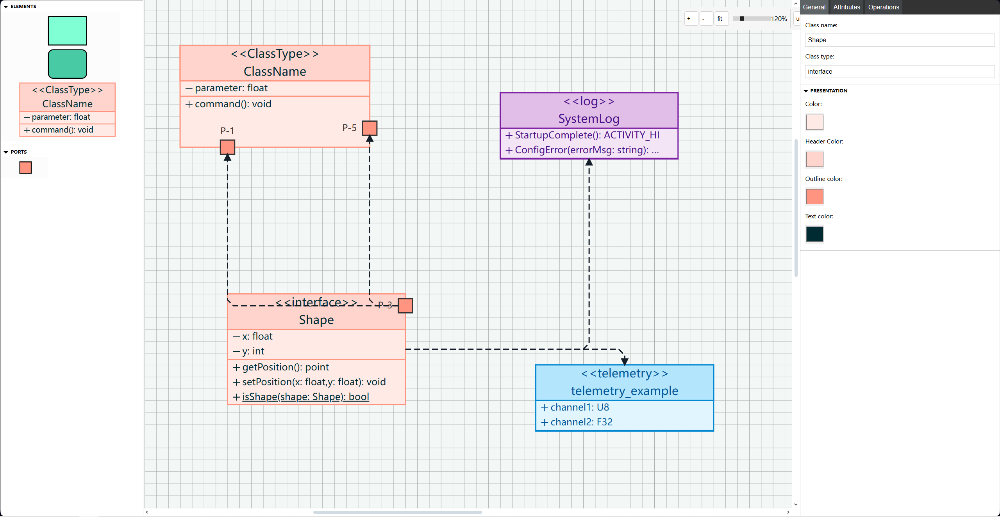

# uml2fpp

一个在线 UML 绘图工具，提供直观的界面设计 F´ 系统架构，并自动生成符合规范的 XML 配置文件。

## 主要特性

- 直观的在线 UML 组件图和拓扑图设计工具
- 自动转换为 F´ 框架规范的 XML 格式
- 实时预览与编辑功能
- 支持导出

## 技术栈

- UML 绘图: JointJS
- XML 处理: xml2js

## 运行

```bash
# Installation
# At first, get your copy of JointJS+.
# If you have a valid license, download JointJS+ from my.jointjs.com. Alternatively, get a free 30-day trial from my.jointjs.com.
# Unzip the file and navigate to the build/package folder inside.
# Copy the joint-plus.tgz joint-plus.css file and paste them into the root of package.
npm add joint-plus.tgz
npm install
npm run dev
```

## 演示



## References

- https://docs.jointjs.com/learn/quickstart/
- https://www.jointjs.com/jointjs-plus
- https://www.jointjs.com/demos/uml-class-diagrams
- https://www.jointjs.com/demos/uml-class-shape-inspector
- https://www.jointjs.com/blog/15-community-designed-demo-apps