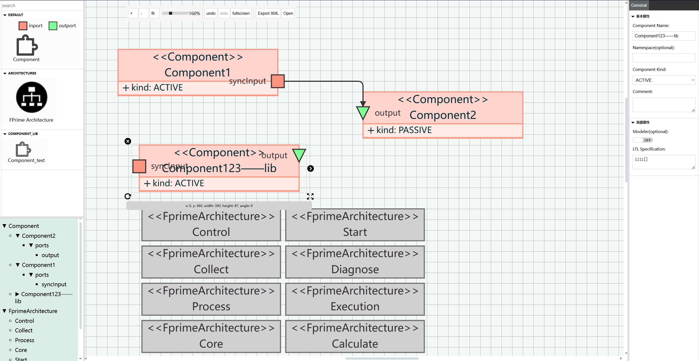
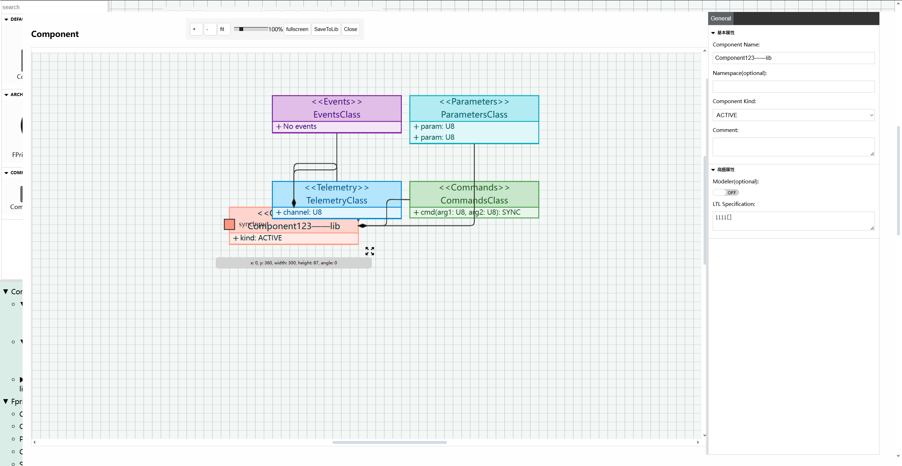

# uml2fpp

一个在线 UML 绘图工具，提供直观的界面设计 F´ 系统架构，并自动生成符合规范的 XML 配置文件。

## 主要特性

- 直观的在线 UML 组件图和拓扑图设计工具
- 自动转换为 F´ 框架规范的 XML 格式
- 实时预览与编辑功能
- 支持组件子图（Events、Telemetry、Parameters、Commands）编辑
- 支持组件库保存与加载
- 支持导出

## 技术栈

- 前端绘图: JointJS Plus
- 后端服务: Flask
- 数据交换: JSON

## 目录结构

```
uml2fpp/
├── .gitignore                 # Git忽略文件配置
├── README.md                  # 项目说明文档
├── assert/                    # 静态资源目录
│   ├── index.png              # 主页面截图
│   └── subgraph.png           # 子图页面截图
├── backend/                   # 后端代码目录
│   ├── .gitignore             # 后端Git忽略配置
│   ├── README.md              # 后端说明文档
│   ├── requirements.txt       # Python依赖列表
│   ├── router.py              # 路由控制器
│   ├── component_lib/         # 组件库存储目录
│   └── image/                 # 图片存储目录
├── fprime/                    # F´框架文档目录
│   ├── fprime.md              # F´框架详细介绍
│   ├── note.md                # 笔记
└── frontend/                  # 前端代码目录
    ├── .gitignore             # 前端Git忽略配置
    ├── index.html             # 主页面HTML
    ├── index.js               # 主要JavaScript入口
    ├── package.json           # NPM配置文件
    ├── resize.js              # 布局调整功能
    ├── vite.config.js         # Vite构建配置
    ├── command_manager/       # 命令管理模块
    ├── halo/                  # 选择效果模块
    ├── inspectors/            # 属性检查器模块
    ├── keyboard/              # 键盘快捷键模块
    ├── link/                  # 连接线模块
    ├── menu_tree/             # 菜单树模块
    ├── models/                # 数据模型
    ├── notification/          # 通知模块
    ├── paper_scroller/        # 画布滚动模块
    ├── port_move_tool/        # 端口移动工具
    ├── selection/             # 选择模块
    ├── shapes/                # 图形形状模块
    ├── stencil/               # 元素面板模块
    ├── subgraph/              # 子图模块
    └── toolbar/               # 工具栏模块
```

## 运行说明

### 后端服务
```bash
cd backend
python -m venv venv
source venv/bin/activate
pip install -r requirements.txt
python router.py
```

### 前端应用
```bash
# 安装JointJS Plus
# 如果您有有效许可证，从my.jointjs.com下载JointJS+
# 或者获取30天免费试用版
# 解压文件并导航到build/package文件夹
# 复制joint-plus.tgz和joint-plus.css文件到项目根目录

cd frontend
npm add joint-plus.tgz
npm install
npm run dev
```

## 功能演示

### 主编辑页面


### 子图页面


## 参考资源

- [JointJS快速入门](https://docs.jointjs.com/learn/quickstart/)
- [UML类图演示](https://www.jointjs.com/demos/uml-class-diagrams)
- [UML类图属性编辑器演示](https://www.jointjs.com/demos/uml-class-shape-inspector)
- [社区设计的演示应用](https://www.jointjs.com/blog/15-community-designed-demo-apps)

## 遇到的问题及解决

- 社区提问及解决: [Joint讨论区](https://github.com/clientIO/joint/discussions/2891)